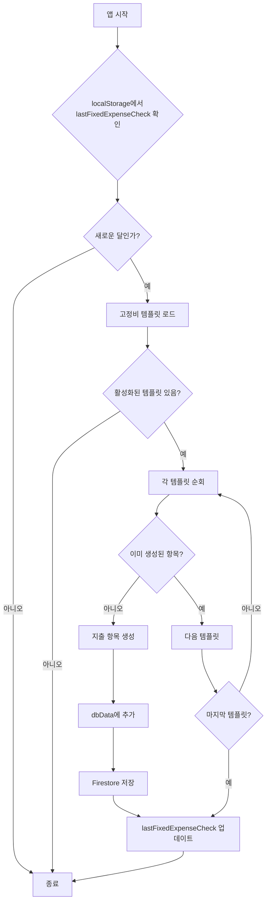

# 고정비/변동비 자동 생성 기능 구현 계획

## 📋 개요
매월 초 자동으로 고정비 항목을 생성하는 기능을 구현합니다. 사용자는 설정 화면에서 고정비 템플릿을 관리할 수 있으며, 새로운 달이 시작되면 자동으로 해당 항목들이 지출 내역에 추가됩니다.

## 🎯 주요 기능
1. **고정비 템플릿 관리**: 설정 화면에서 고정비 항목 추가/수정/삭제
2. **자동 생성**: 매월 초 고정비 템플릿 기반으로 지출 항목 자동 생성
3. **Firestore 연동**: 고정비 템플릿 데이터를 Firestore에 저장/관리
4. **기본 템플릿 제공**: 7개의 기본 고정비 항목 제공

## 📊 데이터 구조

### Firestore 구조
```javascript
budgets/{userId}
  ├─ dbData: {...}
  ├─ categories: [...]
  └─ fixedExpenseTemplates: [
      {
        id: "uuid",
        category: "생활비",
        description: "생활비(효원)",
        amount: 4000000,
        dayOfMonth: 1,
        isActive: true,
        createdAt: timestamp,
        updatedAt: timestamp
      },
      ...
    ]
```

### 기본 고정비 템플릿
```javascript
[
  { category: "생활비", description: "생활비(효원)", amount: 4000000, dayOfMonth: 1 },
  { category: "용돈", description: "규리", amount: 1000000, dayOfMonth: 25 },
  { category: "용돈", description: "시연", amount: 800000, dayOfMonth: 25 },
  { category: "대출상환", description: "담보대출(0.8억)", amount: 350000, dayOfMonth: 27 },
  { category: "대출상환", description: "담보대출(1억)", amount: 350000, dayOfMonth: 27 },
  { category: "대출상환", description: "보금자리론(1.2억)", amount: 350000, dayOfMonth: 30 },
  { category: "세금/공과금", description: "건강보험료(지역)", amount: 177450, dayOfMonth: 10 }
]
```

## 🔧 구현 파일

### 1. 새로 생성할 파일

#### `src/utils/fixedExpenseHelper.js`
- 기본 고정비 템플릿 상수 정의
- 자동 생성 로직 유틸 함수
- 날짜 비교 및 중복 체크 함수

#### `src/components/modals/FixedExpenseModal.jsx`
- 고정비 템플릿 목록 표시
- 추가/수정/삭제 UI
- 활성화/비활성화 토글
- 기본 템플릿 초기화 버튼

### 2. 수정할 파일

#### `src/services/firestoreService.js`
추가할 함수:
- `saveFixedExpenseTemplates(userId, templates)`: 고정비 템플릿 저장
- `loadFixedExpenseTemplates(userId)`: 고정비 템플릿 로드
- `updateFixedExpenseTemplate(userId, templateId, updates)`: 특정 템플릿 수정
- `deleteFixedExpenseTemplate(userId, templateId)`: 특정 템플릿 삭제

#### `src/context/BudgetContext.jsx`
추가할 상태 및 함수:
- `fixedExpenseTemplates`: 고정비 템플릿 배열 상태
- `isFixedExpenseModalOpen`: 모달 열림/닫힘 상태
- `setIsFixedExpenseModalOpen`: 모달 상태 변경 함수
- `autoGenerateFixedExpenses()`: 자동 생성 로직
- `checkAndGenerateMonthlyExpenses()`: 매월 체크 로직

#### `src/components/views/SettingsView.jsx`
수정 사항:
- 109번 라인의 "고정비/변동비 기준 설정" 클릭 이벤트 연결
- `onClick={() => setIsFixedExpenseModalOpen(true)}` 추가

#### `src/App.jsx`
추가 사항:
- FixedExpenseModal 컴포넌트 import 및 렌더링

## 🔄 자동 생성 로직 흐름



## 📝 구현 단계

### Phase 1: 기본 구조 생성
1. ✅ `fixedExpenseHelper.js` 생성 - 기본 템플릿 및 유틸 함수
2. ✅ `firestoreService.js` 수정 - 고정비 관련 함수 추가

### Phase 2: UI 컴포넌트
3. ✅ `FixedExpenseModal.jsx` 생성 - 고정비 관리 모달
4. ✅ `SettingsView.jsx` 수정 - 모달 연결

### Phase 3: 상태 관리 및 자동 생성
5. ✅ `BudgetContext.jsx` 수정 - 상태 및 자동 생성 로직 추가
6. ✅ `App.jsx` 수정 - 모달 렌더링

### Phase 4: 테스트 및 검증
7. ✅ 고정비 템플릿 추가/수정/삭제 테스트
8. ✅ 자동 생성 로직 테스트 (날짜 변경 시뮬레이션)
9. ✅ Firestore 동기화 테스트

## 🎨 UI 디자인 가이드

### FixedExpenseModal
- **레이아웃**: 전체 화면 모달 (모바일 친화적)
- **색상 테마**: 
  - 생활비: 파란색 (#3B82F6)
  - 용돈: 초록색 (#10B981)
  - 대출상환: 주황색 (#F59E0B)
  - 세금/공과금: 보라색 (#8B5CF6)
- **컴포넌트**:
  - 헤더: 제목 + 닫기 버튼
  - 기본 템플릿 초기화 버튼 (상단)
  - 고정비 카드 리스트
  - 추가 버튼 (하단 고정)
  - 추가/수정 폼 (슬라이드 인)

### 고정비 카드
```
┌─────────────────────────────────┐
│ [분류 배지] 내용                │
│ ₩ 금액                          │
│ 📅 매월 X일                     │
│ [활성화 토글] [수정] [삭제]    │
└─────────────────────────────────┘
```

## ⚠️ 주의사항
1. **중복 방지**: 같은 월에 같은 고정비가 중복 생성되지 않도록 체크
2. **날짜 처리**: 31일이 없는 달의 경우 해당 월의 마지막 날로 조정
3. **타임존**: 사용자의 로컬 타임존 기준으로 날짜 판단
4. **성능**: 자동 생성 시 배치 처리로 Firestore 호출 최소화
5. **에러 처리**: Firestore 저장 실패 시 사용자에게 알림

## 📚 참고사항
- 기존 CategoryModal 컴포넌트의 디자인 패턴 참고
- 기존 dbData 구조와 호환되도록 구현
- 사용자가 수동으로 생성한 항목과 구분 가능하도록 메타데이터 추가 고려
